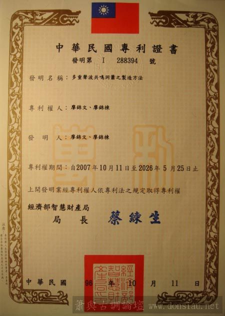
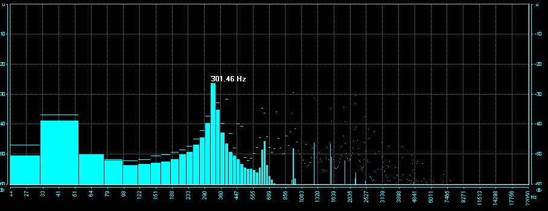

文松簫獨創多重聲波共鳴製簫技術獲得發明專利

### 由林竹到簫管嚴密選材：

文松簫所用材料一律採自台灣高海拔老桂竹，特選厚質堅硬簫材製作，以利音色之通透與厚實，再過多重聲波共鳴製作技術，調製成深疊共鳴的理想洞簫，使每音孔音階均能在音準穩定下以氣息變化共鳴濃淡，並能鬆吹恢復傳統簫無共鳴單音音色

### 待製簫材

### 精心製作：

每把簫都經過精密調製，以竹子個別參數，透過頻譜分析及計頻噐之輔助，完成多重聲波均衡重疊，並測試加壓受力、飽和度、濃淡流暢度，高低音階變化流暢度等，並實際吹奏樂曲應用，細調轉折滑溜度與氣息靈敏度.

### 深疊共鳴規格：

1.精確音準，依不同音律之基礎調製其合律音階，並達到精確的八度音準

2.五度泛音全管音孔經能出聲

3.全管每一音孔均能共鳴至不共鳴，透過氣息可流暢變化操控共鳴濃淡音色

4.全按最低音音量以管口量測分貝數超過110db以上

5.受力加壓程度與弱音之靈敏度，合乎獨奏曲演奏張力需求

6.可控制張力變化之音準偏移在十音分以內
