# 文松簫製作流程

* 修剪整理根鬚

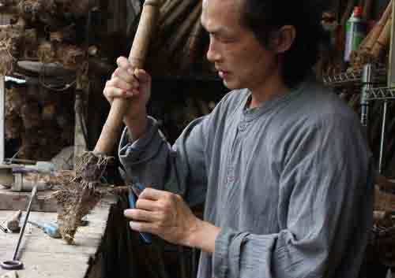

* 烘烤、調直

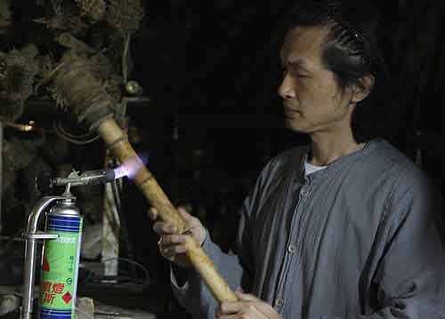

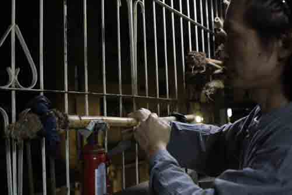

* 烘烤、調直

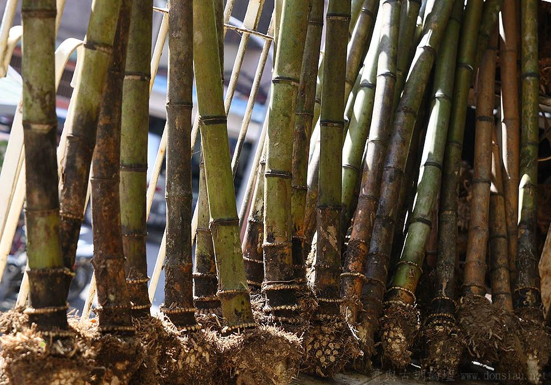

* 打通管徑

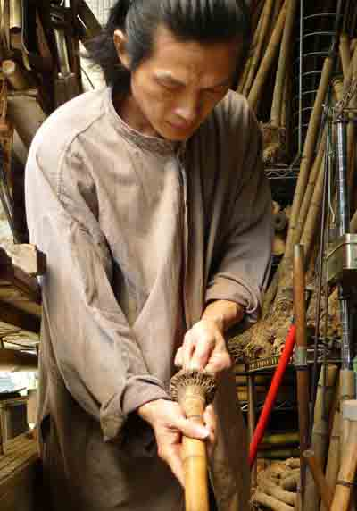
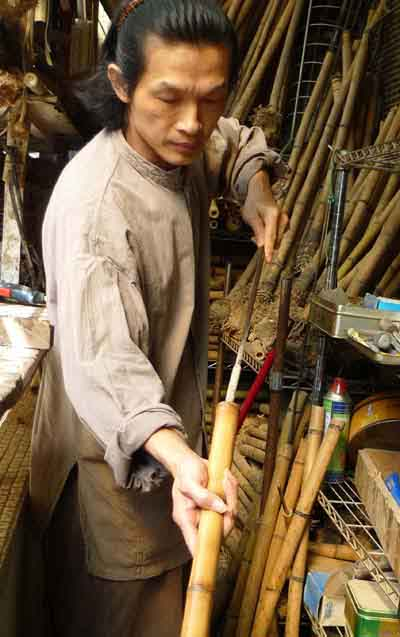
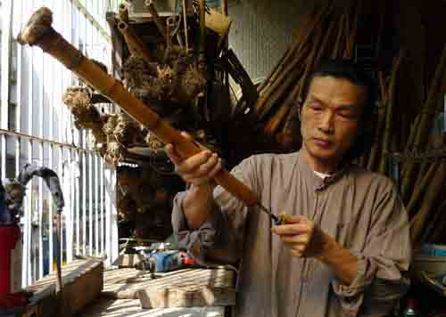

* 磨成粗胚

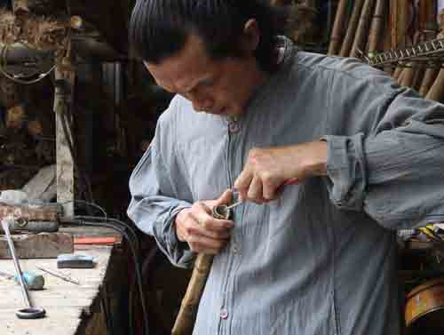

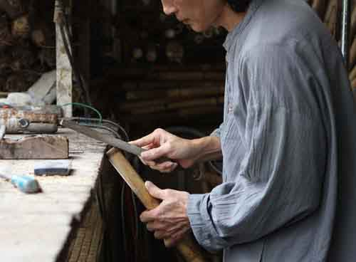

* 開吹口，額面角度粗胚成形

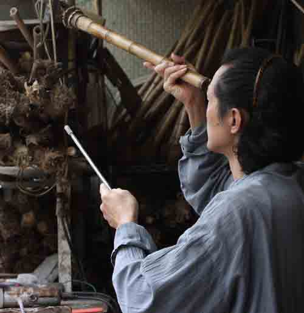
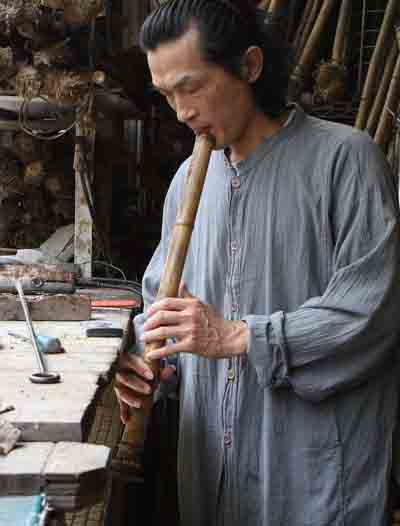

* 定音孔，調音，試音調整音準

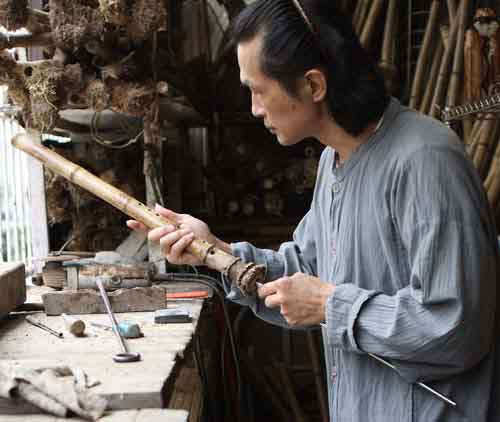
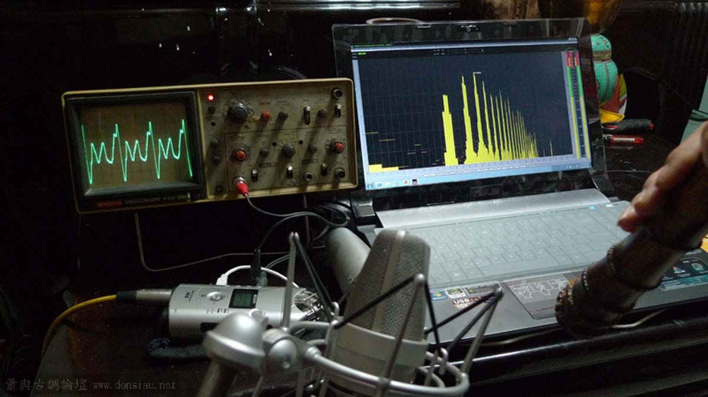

* 調共鳴，多重聲波驗證，反覆調整細修每個音孔的多重聲波重疊度，及相位吻合度

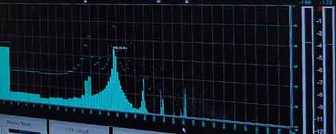
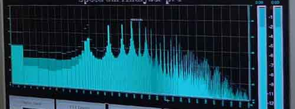

使原來單聲波（左圖）完成各音孔之多重聲波重疊（右圖）並使音準在共鳴變化下維持恆定

管徑無風阻處理與精密細調，及各音孔之多重聲波共存相容性

最後經過實際試吹獨奏曲驗證轉折、張力範圍與流暢度，細部修正轉音、靈敏度及濃淡轉換的直線性，及確認音律之精確度

必要時驗證最大飽和全按低音音量分貝數值
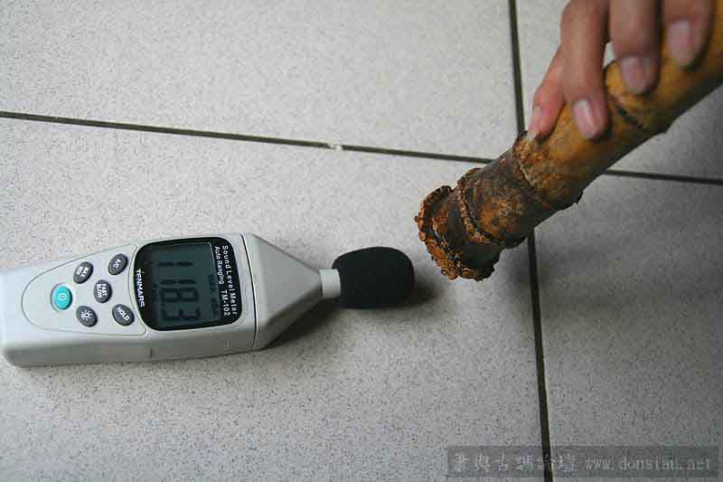

