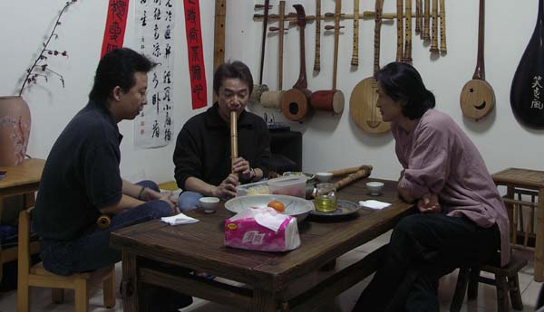
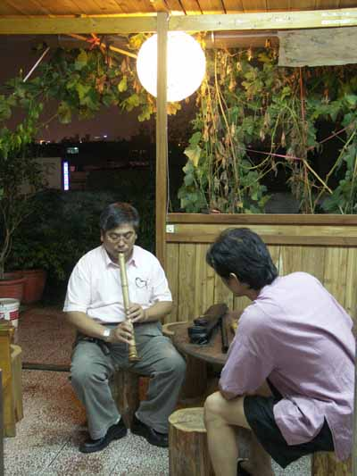
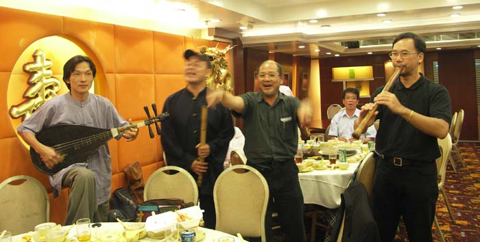
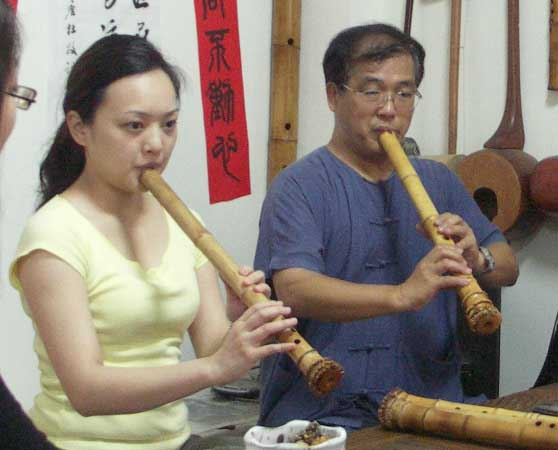
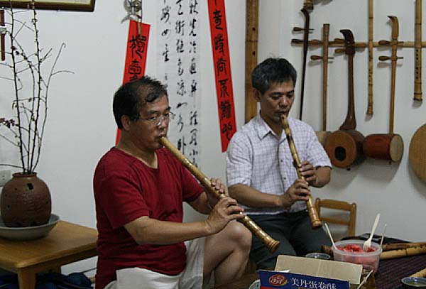

# 使用文松簫作品的專業人士
> 文松實驗多重聲波共鳴洞簫製作法，獲得發明專利，作品廣獲專業人士肯定與愛用，使用與交流擴及海內外演奏家，感謝眾多專家們參與文松簫之驗證與發展，期望大家為洞簫藝術的發展開啟新頁.

* 台南藝術大學陳中申老師(圖中)

* 台灣藝術大學劉昱昀老師(左三)

* 香港陳鴻燕老師(圖左)及其弟子陳佳文老師(長笛教師(上圖中)、張天佑老師（缺圖）

*北京張維良老師(左)

* 安徽吳安明老師(圖左)

* 漢唐樂府高茂桐老師(圖左)及莊瓊虹老師(缺圖)

* 北港蘇仁義老師（圖左），祭典音樂演奏家

* 基隆市立國樂團吹管組長黃聖宏老師（圖右）

* 高雄市立國樂團孫沛元老師(圖右)吹鼓吹小站主人

* 台北市立國樂團蔡榮文老師(右)

* 台灣戲曲學院林恩緒老師(圖左)

* 文化大學吳宗憲老師(圖中)

* 木笛演奏家劉永泰老師(圖中)

* 實驗國樂團陳俊憲老師(圖左)　

* 台中笛簫教師榮大偉老師

* 台南蔡學仁老師

* 台北蘇文宗老師(圖左)

* 香港李華文老師(圖右一)

* 香港粵曲家陸冠恩老師(圖中)

* 實驗樂團劉貞伶老師(圖左)

* 戲曲學院莊家煜老師(左一)　

* 台北市立國樂團吳瑞呈老師(右)

* 台北市立國樂團林慧珊老師

