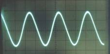
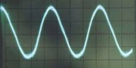
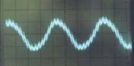
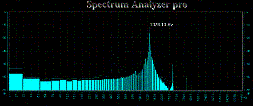
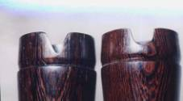

# 洞簫音色的差異與控制

簫音是洞簫吹奏上很重要的要求，簫音的變化可以改變樂曲的感覺，因此洞簫所能表現的情境，在簫音的變化上有重要的關係。簫音的不同，除了洞簫特性上的差異外，與吹奏技巧也有關係，以下就洞簫之不同，比較簫音差異，及簫音的變化技巧提供參考。

## 一　吹口方式與音質特性    
洞簫大致可以分為ｕ形吹口，普遍應用於國樂簫。ｖ形吹口，普遍應用於南管簫，尤其大陸。半ｕｖ吹口，台灣傳統洞簫，台灣南管界也多人使用，尤其中南部。與及唐式吹口，日本尺八或台灣國樂界部分人使用於八孔簫。

洞簫吹口方式的不同，除了在吹奏上口風控制的差異外，也影響洞簫音色。以下就物理現象上客觀分析比較。

* １）ＵＶ形吹口

Ｖ（尖）形開口方式風阻係數低，吹口下斜角度內竹口支撐力強，不會產生多餘共振，簫音可以控制相當純淨，在氣聲上相對減低，如圖二聲波，接近正絃波的純音，在頻率分布上，諧波最少。當口風變化讓諧波產生時，可以增加二次諧波與三次諧波，但高頻氣聲仍然減少許多。

Ｖ形南管簫音波純淨

Ｕ形國樂簫有氣聲諧波

唐式吹口的氣聲諧波更大

Ｕ形吹口其圓周較長，入氣口弧度與吹氣成一風阻係數，吹口下方弧度越薄，越容易共振，因此竹管共鳴聲中含有風阻之氣聲與高頻諧振頻率；另因其Ｕ形開口扇狀，面積比Ｖ形三角面積稍大，音量也會稍大。

反觀Ｖ形吹口，其Ｖ形造型與入氣有導引效果，因此風阻低，氣聲因此減低。在音量上，南管音樂有靜謐清雅特質，各樂器音量求和諧，因此簫音量不須太大。

Ｕ形高音波譜 

Ｖ形高音波譜

洞簫的吹口部分，大陸與台灣有些許不同；台灣簫規格十目九節完整，吹口在節外，不能破節；大陸簫吹口多在節內，在第一個竹節破以缺口作吹口。節內與節外的吹口，在口風控制上有些許之差，因為竹節有一弧度，節內吹口正好在弧度上，因此口風稍前；節外開口者，吹口外徑筆直，甚至微微向內斜，因此口風角度稍後。

* ２）唐式吹口（日尺八）

風阻係數最大的是唐式吹口，因為其吹口弧度大，日本尺八鑲上硬質牛角的切口薄，風阻加上吹口共振，其氣聲諧波極大。因為其吹口為外切式，吹口內側為洞簫自然內徑，因此吹氣角度更後，口風扁平。

在唐式吹口上其音波特性式諧波共振頻率可以更多組，也可以細微的接近純音，其純音在口風的適切下,因為其銳利吹口無風阻下，到達簫聲純淨度高於ｖ形吹口。唐式吹口的一般口風下，其氣聲頻率在極高頻部分,其波譜如附圖所示。

ＵＶ吹口比較

節內節外吹口角度比較

唐式吹口的多諧波簫聲

唐式吹口的純聲波譜

## 二　口風與變化音色

洞簫音色的關鍵性影響在口風，口風氣息的控制是吹簫最重要且最基礎的技巧，吹簫的功力在這上面可以看出來，因為口風與氣息的控制能力演變的技巧很多，例如強弱音的控制，簫聲音色的改變，乃至循環換氣都與口風有關，筆者個人認為在口風控制上，每支簫多少都需要經過適應期，以達到駕馭自如，在經驗上，每次吹簫也都有口風的適應期，尤其隔一陣子沒吹簫，一開始吹就需要經過口風適應期，大約十分鐘到半小時。

聽老一輩南管絃友提到古人練簫，為了檢查自己的簫聲音質，對著大缸，讓大缸的共鳴擴大簫聲，讓吹簫口風控制能掌握最佳簫音音色。南管對簫的要求簫音要濃，就是要夠厚實，尤其低音要渾厚，同一支簫可以吹出纖細的雅簫聲，也可以吹出渾厚的濃簫聲，完全在口風的控制上。

口風的控制得宜，吹簫可以省力，不浪費氣息於不必要的地方，因此讓循環換氣變得可能，這也是讓吹簫不會很累的方法。一般人初學吹簫，往往使力過度，簫聲不但不純淨，還吹得頭昏腦脹，上氣接不著下氣。若覺得吹簫很累人就是口風控制不佳。

以嘴唇來分，口風可以分為鬆緊嘴唇兩種，若以簫吹口與吹氣角度可以分順氣，俯切與仰切型。上嘴唇必須變化上下與下嘴唇的前後配合，可以變化氣束的強弱與角度。

* １）扁平氣束
吹唐式吹口在口風控制上需要讓出氣扁平，吹高音更扁細，讓氣束壓力強，而不是加大力氣吹出來，而是嘴唇控制鬆緊，低音時下嘴唇稍後，讓上嘴唇相對在前，口風鬆，簫音就低濃。

唐式吹口著重在平扁口風，角度適中後，透過俯仰角度可以變化音高，約大二度範圍。日本有某流派以偏一邊的的嘴唇吹簫，使用單邊嘴唇的直線性，對扁平口風更有利，其波動俯仰時類似搖頭方式，以約45度角俯仰，群簫吹奏時，長音的搖頭族甚是壯觀！

唐式吹口在俯仰變化上，對音高影響很大，音孔間而且差異不同，其影響同一音階的高低八度音，在俯吹時近吹口的音孔，會造成高八度比低八度高很多，就是俯吹時對低八度的影響大，降低很多，高八度卻降得少。這在吹口特性上需要注意音準的控制。

* ２）圓氣束

吹南管簫的口風屬於橢圓氣束，尤其高音時，變得細窄時可以是小音量的高音，也可以是大音量的高音，完全是口風對氣息的控制。

相對V型（雞嘴）的吹口形式，圓氣束更有力於發揮，在角度上也容許範圍大，不會向唐式吹口，角度不正確，吹不出聲音，V形角度對口風的縱軸適應範圍大一些，因此在吹南管長音控制上比較容易，且在簫音上氣聲少，相對有幽靜的感覺。

早期台灣的簫都是半雞鴨的UV混合方式，有點尖又有點弧度，這樣的簫聲是典型台灣簫味，這樣的口風也是橢圓氣束方式，簫聲聽起來有點甜味。

總的說來，氣息拿捏到最佳時，簫聲在共鳴最佳點，把氣用在適當的地方而不浪費，音量隨心所欲能控制，就是最佳口風。

* ３）口風控制與八度音階

洞簫吹奏音階約有三個八度音，音孔只有一組八度音，八度音階的變化在於口風的鬆緊與氣息的強弱變化。基本上高音需要的氣息強，口風要細緊，低音要鬆口風要弱的氣息。根據這個原理若吹高音需要更大力氣，在實際上是口風縮小，讓氣流加大，並不是維持原來口風加大力氣吹氣，這樣會很累，方法是錯誤的。

口風在控制氣流上做寬鬆的變化，實際操作上是在上下嘴唇的配合，下嘴唇有前後變化，也有上下變化，來配合不同音階所需要的氣流。

良好的控制口風與氣息可以讓高音也可以很小聲，讓低音也可以很大聲，初學者容易是吹高音很大聲，吹低音階變得小聲，這就是還需加強的地方。  

在不同的音孔有不同組的音階，每一音孔都有多組音，以筒音最多，筒音多半能吹出最低音，第二八度音，第二八度之五度音，第三八度音等，這是兩倍頻音與三倍頻音等。其餘音孔也能吹出兩組以上音階（二倍頻），如果倍頻頻率準確時口風控制可以同時出現。

* ４）口風控制的音色變化

透過口風控制來變化簫聲音色，是吹簫重要的技巧，也是一支簫的性能評價之一。這樣的效果在台灣或國樂領域中比較被忽略，在日本尺八上尤其著重這樣的音色變化，透過頻譜分析與聲音波形檢測，很容易可以發現音色的變化情形，透過音波顯示可以精確檢測出簫的共鳴好壞與吹簫者口風控制能力。  

簫音色變化的原理在其簫音諧波的變化，簫音主音波與諧波的分布與諧波組的強度變化。透過口風的控制，讓簫聲出現不同八度或五度音的重疊，就是簫聲共鳴變化的音色。這須由精良的簫性能與熟練的口風控制技巧兩者兼顧來達成。

讓簫聲可以有多樣性的變化，表現樂曲的不同情境，讓簫聲更豐富些，是有必要追求的。口風控制洞簫音色的變化，主要讓簫聲變得濃厚或淡雅，這樣的變化除了吹簫的技法上追求外，洞簫的性能也是重點。

* 氣鳴角度

簫音的變化在實際的口風原理上是口風在洞簫吹口上的切入角度與氣束強度變化關係，洞簫吹口有一定的角度，若吹氣與入口成順暢狀態，簫聲屬於純聲，聽其來比較單薄，聽來淡雅。若吹氣角度略為高於入氣口時（視簫而有別，或稍稍俯吹角度），會讓洞簫的氣鳴角度加大，在出聲吹口上出現諧波，會讓簫音比較濃，這是吹口與口風切角變化的效果，這樣的效果必須配合口風與口勁，讓氣束集中才不會造成混濁的感覺，而且在俯吹角度下，上嘴唇必須收緊，才不至於減低開口率而音高降低。

* 多次諧波

若洞簫性能好時，透過口風的變化可以讓簫聲同時出現多次倍頻諧波的震幅，它是一種共振頻率的出現，就好像竹笛貼了笛膜的聲音，也讓笛聲出現不同倍頻的諧波，讓笛聲不是純正弦波，這樣的現象在簫聲的低音域尤其明顯，南管簫的品味就是濃音，簫聲很濃，就是在低音中出現諧波。南管界有人稱這叫筒音，說某支簫的 筒音很好，很濃。在性能好的洞簫不僅全按的統音有好共鳴度，而且孔孔都有，不同八度都有才是最佳性能。

前節敘述有關吹口的音色差異，與口風控制音色共鳴的不同，主要吹口不同是在氣聲。在諧波上是屬於高頻諧波，就是比較尖銳的氣聲。共鳴聲的諧波屬於與主波相鄰的倍頻震幅及五度音振幅，還有整體諧振後的多阻副頻。在實際的音色感覺上，唐式的共鳴聲，聽起來有"霧霧"的感覺，音色也變厚。而UV型吹口的共鳴聲聽起來有明亮又厚實之感。整體現象是多樣的頻率一起諧振發出的聲波。下圖為實際波譜比較。

因為每支簫的性能不同 ，其變化諧波音色的音孔可能也有所不同，最好的性能是每孔音階都可以變化出現多組諧波，根據經驗，多數傳統簫只有筒音有，其餘音孔很少能出現，甚至連筒音都無法出現者也不在少數。其關鍵在於下述，八度與五度間音準關係。

雖然洞簫可以吹出多次諧波簫音，重要還是在於應用控自上的自如運用，若凡吹必吹此聲，也覺得不是很恰當的運用，淡雅簫聲仍然有其特色，拿捏在音樂情境的必要性。

唐式吹口的多諧波簫聲

唐式吹口的純聲波譜

Ｖ形口風控制多諧波濃簫聲

Ｖ形吹口的純聲波譜

* ５）音準與音色的關係

基本上洞簫音色與竹才密度與吹口方式最大關係，但是音準與音色仍然有關係，這出現在自然共振諧波的情形。例如筒音可以吹出低音，中音，五度泛音，第三個八度等，口風控制得宜時，可以吹出低音中音五度泛音同時出現。或中音與第三八度一起出現。這樣的同時諧振音的出現基本前提是其音律是合乎自然律動頻率時才會出現，不是每支簫都可以。也不一定每個音孔都能出現，好的簫出現共振諧波的音孔越多，而且共振頻率出現越多組。

如果能出現共振頻率的音孔，就是在同一口風角度下，其八度關係或五度關係合乎自然音律的頻率。其音律關係是精密準確的。

## 三　結語

透過客觀的音波分析，可以明確的顯現出洞簫在音色上的變化，與口風控制上的相對關係。對於洞簫技藝的突破與進階過程，提供了客觀的依據，不管對洞簫本身性能的要求，或吹奏上的技巧都值得進一步思考。

以上論述為筆者利用個人在音響工學領域上的基礎，就自己製簫吹簫的心得提供參考，就教於大家，並希望進一步討論。
