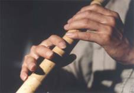
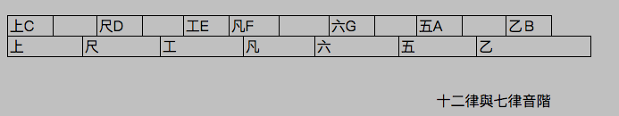
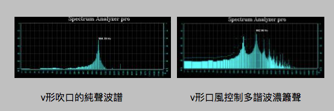

# 南管簫的特色
## 一　前言

南管演奏若吹管部分以洞簫為主奏時，稱為「洞管」。以品簫（竹笛）為合奏主角時稱為「品管」。可見洞簫之名與南管有相當淵源。甚至可以說洞簫就是南管簫。（注：有人以洞館與品館來稱呼館閣差異，筆者認為以民間音樂通用調性稱呼”管門”之管字比較恰當，類似：南管戲曲中品管又分大工管、小工管、擠管等.）

洞簫在南管音樂中負責將旋律完成，扮演著樂曲的靈魂角色，對音樂風格與旋律模式有相當的影響；由其南管音階範圍就是以洞簫所能表現的範圍，琵琶品相範圍根據洞簫的最低筒音到第三八度的六度音來制定，可見洞簫在南管的重要性。

學南管簫是吹簫者很好厚植實力的途徑。因為慢又長的南管樂曲，吹奏時可以練就吹簫實力，對氣息的控制與耐力都是最佳的考驗。豐富的南管曲牌旋律，可以增進音樂旋律的內涵基礎。南管旋律中為簫所留的空間，更是吹簫者最好學習發揮對音樂旋律的靈活應變能力。

台灣所稱之洞簫，其實就是指南管簫，只是真正在南管界中的洞簫與街坊的洞簫又有些許差異。南管簫要求規格嚴謹，價格也比較昂貴些。本文以個人實際學習心得，比較在傳統樂簫，吟詩簫，南管簫等，不同之處，尤其洞簫在南管應用之特點，就樂器特質，音律，音色，技法與旋律風格等說明。

 

 ## 二．規格

 南管簫在規格上有嚴格規範：十目九節，尺八長，三目鳳眼，五目開音，一目兩孔，十目開竅。對長度、竹節與音孔的相對關係上做嚴格限制。竹結音孔規格除了美觀外，也兼具實用性，讓持簫手指方便按孔，不會跨越竹節位置。

 
 
 
 吹口名曰：開竅，台灣吹口在竹節以外，才合乎規格，竹節內開竅為“破格“，大陸則不同，普遍是開竅於節內。在實用上節內與節外的開口吹奏上，口風角度有些許不同，節內需要較俯吹角度。節內開口造成竹節缺口，是簫的弱點，容易形成裂痕。

 * 尺八

 洞簫又名尺八，據舊唐書‧呂才傳：「能為尺八十二枚，尺八長短不同，各應律管，無不諧韻。」因此推斷為唐朝呂才所創。呂才將原來的多管無底排簫改成單管多孔之尺八。而且長短有十二支，都合乎律管音高。

 尺八由來應該是與音律之始，律管基音：“黃鐘之長九寸”有關，採用低八度黃鐘音作為最低音，因此以兩倍黃鐘長度一尺八寸做簫管，應該是合理推測。

 南管簫雖言尺八簫，真正合乎尺八規格者少數，在實際的應用上，容許略長於一尺八寸，約到兩尺都有人用，著重在竹結與音律的標準。

 * 音孔鳳眼

 南管簫的鳳眼開在根部算起第三節處，開鳳眼兩孔橫開如鳳之眼。第五結處開始開音孔，一節兩孔，開立五孔在前，最上一孔在背後。

 經實驗黃鐘律管之音高接近-#D，若將原來律管（閉孔）音高改用吹口（開孔）方式時，音高會降低到C左右，因此開兩孔鳳眼是為了筒音符合原來黃鐘音高。日本尺八無鳳眼，乃因外切吹口音高會升高，而且平均內徑較細，因此不需鳳眼。

 沒有鳳眼的尺八以管長為筒音高度，有鳳眼則以鳳眼高低大小影響筒音高度。有鳳眼的南管簫，音色上比較幽暗感，音色是內聚形，近聽與遠聽都覺得一樣大聲，聲波穿透力強。

## 三．音律

音律與是音樂的基礎，樂器間彼此的音階協調，所謂和諧都是建立在一定的音律基礎上。從另一個角度而言，音律也關係著音樂風格。

*	十二律

『詞林典腋』音樂門中提到音律如下：

斷嶰谷之竹,聽鳳凰之鳴,黃鍾之長九寸,為萬物之本根,每三分為損益,隔八位而相生,陽為律而陰為呂,有正聲亦有變聲,六十調但用其正十二律…

古音律之形成以竹管定之，三分損益法是很重要定音方法，減三分之一長度的竹管其共鳴聲將升高五度（例如由Ｃ升為Ｇ），增三分之一長度將降低四度音（例如由Ｇ降為Ｃ），反覆增減，產生音差，又將高低八度音互相參考，以產生十二平均律。

《禮‧月令》注中說明古音律由黃鍾為首，九寸竹管定音為音律之始，音名為宮，假設相當於Ｃ音。黃鍾之長減三分之一(六寸)生得林鍾，音名為徵，即相當於高五度的Ｇ音。林鍾增三分之一生得太簇，長八寸，降低四度，音名為商，相當於Ｄ音。太簇之長減三分之一，為五又三分之一寸，又升高五度，得南呂，音名為羽，音高接近於Ａ。南呂之長增三分之一，為七又九分之一寸，音降低四度，生得姑洗，音名為角，音高相當於Ｅ音。由姑洗減三分之一長度，生得高五度的應鍾，其長四又二十七分之二十寸（4.741），相當於Ｂ音。應鍾增三分之一得蕤賓，長六又二十六分之八十一寸(6.321)，約#Ｆ音高。蕤賓增三分之一長得大呂，長八又二百分之四十三寸（6.215），約#C音高；太呂之律減三分之一長生夷則，為五又七二九分之四五一吋，音高#G；夷則增三分之一生夾鐘，長七又三千一百八十分之一千零五寸，音高為#D。夾鐘減三分之一生得無射，長四又六五六一分之六五二四寸，音高#A；無射增三分之一長得仲呂，長六又一九六八三分之一二九七四寸，其音F。

古音律所注明之長度，若以相同內徑的管，經三分損益法，所產生的管音，並無法產生十二平均律，三分損後的管音，與原管相差接近完全五度，但低約二十音分，三分益後的管音，也不到四度音，差約10音分；八度音的一半長度，相差更多，約有五十音分以上。

實驗結果：

長度(1.5公分內徑)    閉一端吹音

九寸                #d +10

六寸                #a –10

四點五寸            #d –45

八寸                f –20

再實驗內徑二公分，與實際洞簫雷同之管，所得之音，在絕對音高略低十音分，相對音一樣有誤差。這樣的現象在古律的形成上產生很多爭議，也懷疑五度相生律根本無法還原驗證。

筆者再以實際兩支大小洞簫實驗，卻得到一半長度等於八度音的結論，其關係在筒徑：

洞簫一：全長77公分，筒徑：吹口2.1公分，尾口1.6公分 鳳眼全閉，筒音G。（此簫原筒音為A）

洞簫二：全長38.5公分，筒徑1.5公分，尾端1.3公分，無鳳眼，筒音g。

圖十　兩支筒音ｇ1的小簫，與倍長的ｇ簫等長(鳳眼扣除)

經實際洞簫測試結論，再以等比例變化內徑的直管測試三分損益結論，音階，即合乎十二平均律的音準了。此結論早在明朝的朱載堉，曾經證實過；其『律呂精義』中提到：「先儒以為長短雖異，圍徑皆同，此未達之論也。今若不信，以竹或管製黃鐘之律一樣兩枚，截其一枚，分做兩段，全律半律，各令一人吹之，聲必不相和矣。此昭然可驗也。又製大呂之律一樣兩枚，週徑與黃鐘同，截其一枚，分做兩段，全律半律，各令一人吹之，則亦不相同。而大呂半律，乃與黃鐘之全律相和，差略不遠」。

五度音差在頻率上是1.5倍的音頻，在自然音律的產生過程中，除了三分去一得到五度音以外，在閉管吹音中，也可以吹出高八度的五度音，其頻率是三倍於基音，因此五度音很自然地被古人用來做樂器的定音。例如二弦、三弦之一二弦、阮咸之內外二弦等等，另外在三分損益法中的四度音，也用來樂器定音，例如琵琶、三弦之二三弦、阮咸之中二弦等等。

* 七律

七律的由來有人說從中東引進中國，典型是存在於吹管樂器的勻孔開制，大陸河南省出土的最遠古骨笛，距今八千年歷史，看起來接近勻孔制，根據中國音樂史記載測試吹音，其音階接近七律的音階。骨笛開孔有七音孔，重複兩音，與筆者實驗完全七律小簫不謀而合。

七律制不知開始於何時，在清朝被理論化，並記載於歷史文獻中，屬「康熙十四律」，在康熙勒撰的【呂律正義】中將音律分成「七律」和「七呂」共十四個音階，「七律」和「七呂」分別是兩組相典型七聲音階，兩組相差十四律的一個音的音高。在實際的樂器製作上由「七律」所產生的「姑洗笛」，及由「七呂」所產生的「仲呂笛」，實際上是兩支六個指孔的勻孔笛，可見「康熙十四律」是將民間七律制整理並細分而成。

七律簫與十二律簫音孔比較

在傳統樂器中，多數古老吹管樂器，如篳篥、古笛、簫、嗩吶等樂器都是勻孔開製，其自然音階多屬七律制。例如以嗩吶為主樂器的北管鼓吹樂即是典型七律制，因為方便七管反（轉七調），由嗩吶的自然音階：七平均律為其旋律風格，但在“戲曲”中，由於以管絃樂器居主導，就有偏向七律與十二律融合之“乙凡中立音階”模式。

七律短簫(筒音G+)

* 折衷律

在十二律與七律交融使用中，產生一種折衷，彼此融合的情形，也可以說是傳統管樂器與弦樂器交融的結果，就絃樂器而言，十二平均律為其自然特色；而管樂器自然特色就是七平均律。

在音律規則上，弦樂器可以規則地定音，因為倍頻（高八度）等於琴弦一半距離，其弦共振頻率單純，決定音階的品相可以細分半音階，而且琴弦間定音固定後，可有同音異弦異位，也是方便靈活演奏，這也是十二平均律才能達成。管樂方面，吹管共振與吹口、開孔與頻率之間，關係複雜，吹管一半長度不等於高八度音，樂器指孔也無法開到細分十二律，其自然特性上形成七聲音階的應用，七聲音階的六孔若開成勻孔，就形成七平均律模式。

七律與十二律的樂器若在合奏上，顯然有不和諧情形，因此演變過程中，除了演奏者可以透過對樂器的控制技巧調整音準以外，在樂器製作上與律制上有了部分的調整。

七律與十二律的合奏可有絃就管或管就絃，彼此遷就互動的模式，絃就管部分，絃長震動距離稍長，自然音稍低，按絃力度變化就能變化音高。管就絃部分，吹管俯仰控制可以變化音高，叉孔指法等都是管就絃的應用。

在實際互動下，演變成音律的折衷，就是擴大八度的七律音階，可以接近十二律刻度，唯獨在以凡半音階出現折衷現象，學者稱之為“乙凡中立音階“中不中立有待商榷，不過不是十二律現象中偏一邊是明確的。

筆者在洞簫與竹笛的製作上獲得經驗，吹管樂的開孔雖是勻孔開製，卻能接近十二平均律的音準，但在小三度的半音間，「乙」、「凡」音，有些許折衷，這與「乙凡中立音階」不謀而合。

在七律的自然音階中，很顯然尺、工、六、五等音與十二律相比偏低，因此在七律樂器中，多已做修正，使五度音及八度音間範圍加大，使之與十二律音相和，如下圖。經過加大倍頻的七律音階，在主音（上尺工六五）上已接近十二律音階，唯有乙凡音，與十二律不同，其自然音階落於前後兩音之間。

 

 實際的樂器演奏中，管樂器在指法上，以蓋下孔方式降低小三度（工六，五上間）的上、六兩音，以使調整後的五度音及八度音偏高問題獲得調整。

  

上述之乙凡中立音階模式，實際上乙凡音階並不完全居於其相鄰兩音之中，因為是上、六兩音的彈性修正（乙凡音孔蓋住），在首調制中，維持６１、３５間小三度之完整。

七律與十二律同時存在於中國各種傳統音樂中，交互影響，甚或融合使用；也形成傳統音樂的特種風格、風味。近年來，西方音樂主導樂壇，多半研究音樂的人以純十二音律來解釋傳統音樂，或革新傳統；認為傳統音律不準，將樂器完全改成合乎十二平均律之標準，對傳統音樂而言，已經減少了其特有的風味了。

南管簫的音律也是合乎這樣的折衷方式，一樣是勻孔，音孔間距越小，樂近七律，間距越寬，越接近十二律。從南管老館閣中的簫驗證，其開孔勻孔，其間距已經擴大到全開的音接近全按的音，甚至低於半音階（小二度）。

* 絕對音高

目前普遍的音高都跟隨西律，ａ=440hz或442hz，大陸南音也改制合乎西樂標準。唯獨台灣南管界維持自古流傳。

南管基音為工，就是洞簫的筒音，在台灣南管界中，普遍的洞簫都高於D的音階，有二十音分到一百音分（#D），普遍還是以高五十音分為多。

照洞簫形成而言，應該是比照律管黃鐘音高，歷代不少人做音律的考證，結論諸多不同，據楊蔭瀏【中國音樂史綱】中，宋大晟九吋律與金元明雅樂律的黃鍾為Ｄ(+29.43音分)，明朱載堉的黃鍾bＥ(+21.42音分)，清康熙律的黃鍾為Ｆ(-24.1音分)。筆者實驗發現，以魯班尺九寸管之音階，其閉孔方式吹音接近#d（律管方式）；若以開口方式吹音則接近c。

由上述可以發現，台灣南管工音接近律管。

## 四．技法與應用

南管簫在吹奏上有些獨特之處，或可說南管特殊美學觀，源自古老的發展，南管樂的特質是幽靜而意境深遠，音樂型態是從容而氣定神閒的，從這樣的特質上可以發現與古人的生活哲學是息息相關的。

南管是一種最佳練簫方式，因為南管曲子慢又長，簫聲的氣息控制與耐力可以在這之間練就。雖然南管簫的技法不難，卻著重在穩紮穩打的基礎功。

* 平穩純音

南管的簫音著重乾淨平穩，很少應用波動腹吟方式。要吹出穩定單純的簫聲還是需要相當的練習與功力。平穩的直音，可以變化音量的直簫聲是南管簫經常性的應用。

在有利於單純音的效果，除了吹奏者的氣息穩定度外，洞簫吹口方式仍然有助於純音的發揮，V形吹口讓氣息風阻減低，讓簫聲更乾淨，可以吹得接近正弦波純音的乾淨。

* 濃淡簫音特質

經常聽南管老前輩提起，簫聲要濃，南管簫喜歡大口徑簫聲，簫聲共鳴厚實，尤其著重在低音時，音量不能變得輕薄。高音能小聲，低音能大聲，簫聲的駕馭便能自如。

為了讓簫聲聽來渾厚，在口風的控制上可以讓簫聲多次諧波出現，簫聲變得比較渾厚，尤其在低音時，其波譜如上圖。濃簫聲在吹奏口風控制上有技巧上的應用，請參考拙作“洞簫音色的差異與控制”。
長音處理方式

南管簫一般是不用腹吟音，著重在強弱音的變化，"初如行雲流水，中間纖細如絲，收尾響如宏鐘"，南管簫的美學類似書法藝術，以沈穩力道為最，不重花巧。在南管音樂中，簫聲需要更成熟練達的功夫，因為曲子緩慢，難度高高在於緩慢的曲子中的沈穩與駕馭能力，忌諱輕浮急躁，需要紮實的基礎功夫，絕不是應變技巧的靈活性，而是內斂沈穩的基礎，與心性涵養有絕對關係。

一開始引腔以正常音量出音，中間轉弱，尾聲轉強，然後引上孔收音，讓尾聲俐落乾淨，並留有餘韻。

* 餘韻

在南管簫聲的尾音，多半留有一點尾韻，這尾韻是洞簫的簫聲殘響，利用恰當的口風與指法的配合，讓急煞收音有餘韻效果。響如宏鍾型，有隱約型，拿捏在於吹氣與指法間。

尾韻的處理讓南管的音階有一種力道，俐落的旋律段落感，這樣的表現尤其在休止符（口）前更為明顯。平常樂句間雖然不一定做出強力餘韻，一般漸弱的處理在南管可以說幾乎不用的方式。

* 抖動顫音

南管經常用到顫音引腔，使用手臂抖動方式，使顫音可以高速綿密。尤其在背孔的打Ｘ時，傳統南管簫還特地用右手在上方式，讓靈活的右手可以快速顫音。抖動顫音是需要練習一下的技巧，顫抖綿密外，還可以分開孔高低，其顫音效果亦有所不同。

抖動顫音的應用延伸背孔拇指顫音，還可以延伸到食指無名指等音孔，例如八駿馬的起音是打士，就可以利用食指顫抖應用，以達到馬聲音效。

## 五．旋律風格

南管曲排豐富，計有百餘種旋律風格曲排。其表現音樂旋律的結構與洞簫有很大關係，在實際吹奏中可以發現，音樂旋律保留給洞簫加花的空間，洞簫靈活應用的音階形成南管特有的旋律模式，以下論述之。

* 應用音階與調式

三分損益法產生十二平均律，做為音律的標準，方便轉調（旋相為宮）用途；古人也將十二律之音，代表著一年的十二個月令，與十二地支有相關係。例如：黃鍾為音律之始，以地支之始“子”來代表，月令在十一月；所生之林鍾，以地支“未”代表，象徵六月。可以看出古人將音樂與生活結合在一起。

音律產生十二律呂，旋相為宮，可以轉成十二個不同的宮，每種宮都有七種調式，因此計有八十四宮調。複雜的調式在實際音樂的流傳中並沒有全部用上，例如唐宋時的「燕樂二十八調」，南宋時的「七宮十二調」，今元時的「六宮十調」，元末南曲的「十三宮調」，明代北曲的「十二宮調」、「五宮四調」，可見流傳下來的是以應用上的方便與實用性為先。

南管調式普遍的有：五空管（Ｇ），四空管（Ｆ），五六四Ｘ管（Ｃ），倍士管（Ｄ）四種，另有四空毛一管（ｂＢ），在特定套指中，還有四不應管（ｂＢ）等。若以轉調模式應用，洞管四調，品管四調，戲曲還有大工管小工管Ｘ譜等，調高變化，類似旋相為宮模式，在南管所流傳指譜中記載，在品簫應用時每孔皆可以為工，計可以有三十五調。這樣的應用宮調唯有合乎七律制才可能有實用性。

* 犯調與轉調

南管使用的琵琶工尺譜，以固定調式，表示典型五聲音階，但其五聲音階在四空管與五空管中，有在不同八度間固定轉調的現象。

四空管的第一、二個八度Ｆ為宮的五聲音階，在第三八度的極六音，並不是原來四空六的高八度，而是降了半音，此原因是簫的關係，在南管簫音階中，並沒有四空極六的音階，當然只能用極六取代，此情形使四空管在高音域時有轉向ｃ為宮的轉調現象，另外在最低八度的四空六在音準上，雖然以蓋下一孔，其音階仍偏高，因此實際在四空管中很少出現低音四空六，此現象也造成四空管音域有較高亢之感。

五空管在中高音域以Ｇ為宮的五聲音階，但在低音域時，轉向以Ｃ音為宮的五聲音階，因為低音的Ｘ，低了半音。此現象可能是因為五空管是南管的主調，五空管的音域範圍，幾乎應用了所有簫的音階，例如在百鳥歸巢、八駿馬等譜中，還加入倍思管以Ｄ為宮的五聲音階，即所謂“同均三宮”的現象。據筆者吹奏經驗，四大譜（四時景，梅花操，八駿馬，百鳥歸巢）均屬五空管，聯奏過程中，洞簫旋律幾乎涵蓋了的所有音孔音階，可見五空管旋律乃發揮簫之極致表現。

除了在一調中以雙調遊走於不同八度外，南管曲中也常有轉調的特色，例如“落倍”即是轉入倍思管，還有“中滾十三腔”，在一曲中遊走於不同曲調，和諧轉換，使曲調之多範圍變化，其應用也被移植於歌仔戲中，例如：以倍士（或大調）起唱是Ｇ宮系，轉七字仔，為Ｆ宮系，若再落大哭調，又轉入D宮系。這樣的轉換過程中，對勻孔簫而言，直接轉調無須更換樂器，使樂曲整體連貫完美。

* 大三度曲折

南管音樂有另一特殊現象與簫有關的是，大三度與大二度之曲折；在洞簫引腔手法中，最常見的是以高大二度的顫音起音，之後轉長音，再與與琵琶同時落主音；或顫音轉長音後落下低大三度音，然後才與琵琶同落主音。而在旋律進行中，簫弦的旋律在搨音中也經常過高大二度音，或過低大二度音，或與大三度並用。在實際的吹奏中，這樣大二度大三度的旋律，已成南管曲韻的特色，在【南音初探】中第三章，詳述有關多重大三度並置。

而實際此特色的形成，是在簫吹奏上，只是鄰近音孔的應用，往上多翻一孔，或往下多蓋一孔，很自然地自然產生這樣的旋律特色。這樣的手法中也使簫的弦律，偶而會用上五聲音階所沒有的特殊半音，而讓旋律脫離五聲音階範圍。

* 五聲音階的延伸

南管琵琶的彈奏，依五聲音階模式，在每個八度音間只有五個音，若以典型五聲音階代表，五空管在琵琶第一弦上，分別是1=ｇ的56123音；四空管是1=f的61235；五六四Ｘ管是1=c的23561音；倍思管是1=d的12356音，可以說是很典型的五聲音階旋律，但實際演奏中加入洞簫後，卻脫離五聲音階範疇，音為琵琶的骨架音雖然在五聲音階上，簫弦加入的旋律音卻不受五聲音階的限制，尤其簫的音階在指法變化中，加入了非當宮系之音，這樣的現象是南管特殊之處。其旋律格局不受五音所侷限，更有大曲之風。

例如五空管的“Ｘ”常以全放Ｘ做過路音，或做引音，全放Ｘ在五聲音階上是#４，打Ｘ時也出現這樣情形。

同樣以骨架音記譜的部分北管曲牌，尤其在散板的吹場，記譜也僅紀錄“音骨”，吹嗩吶者須要自行依據鑼鼓節奏“加肉”“加皮”，其所加之音卻不離該宮系之音，仍維持五聲音階之平整。

									 

* 調式變化與犯調模式之轉移

若將五空管旋律升高四度音，直接以大工管模式演奏時，原來遊走於ＣＧ的五空管，會變成遊走於ＦＣ之間，其音階結構會變成四空管效果。同樣的四空管若將它降低四度仍然會變成五空管音階結構。

由此可見南管的犯調風格，完全是在洞簫的特性上所發揮，因為上升四度後的五空管，若沒有犯調方式洞簫是沒有該孔音階。

若要挑戰南管的高難度，可以將五空管上升四度演奏，如此所謂“簫絃怕因為”就不只套指“因為”難吹，因為調高上升後，簫聲在高音域的長音功力便是直得考驗，每首五空管曲子都會便得高難度。

筆者推斷五空管與四空管的犯調模式，基礎原因是洞簫的音階特性，與反管應用上的方便考慮吧！

															  

## 六 結語

南管音樂的古典文化特質值得傳承，並需要繼續發展它的藝術與美，仰賴眾同好的繼續努力。吹簫者若學過南管簫，有助於掌握傳統簫的韻味，也有助於吹簫實力的練就。個人在學習過程間，體會些許淺薄意見，供諸位前輩參考，尤其在座有南管前輩，希望藉由您們在場的指導與見證，讓台灣簫界技藝水平繼續提昇。謝謝大家！
