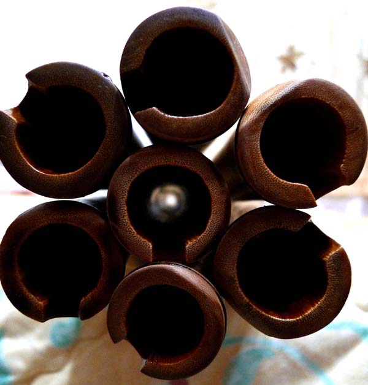

> 為成簫管舒心曲　踏遍雲山仔細尋

> 硬骨磨難猶堅韌　琢痕化作滄浪聲

為濃淡共鳴簫聲的分享與推動，從深山的竹子變成美妙的旋律，一步一腳印，一刀一痕跡，入山跪地取材，嚴密控管雕琢而成多重聲波共鳴洞簫，它不僅是簫藝發揮應用的利器，更是心靈祥和寧靜的良方...

> 空節管中虛  靜心悟入微

> 寂寂平波處  陶然已忘機

古老的樂器，新的生命，傳承自古老文化中的美學與智慧，在當今的繁雜社會中有著重要的功能，它是現代人良好的安頓方法，獨特多重聲波的濃淡變化，聽簫或吹簫，都能在生理與心理的雙重和諧效果下調和身心.

###  竹簫系列

> 為成簫管舒心曲　踏遍雲山仔細尋

###  橫簫及笛系列

